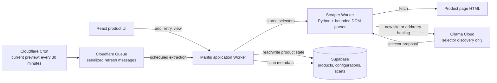
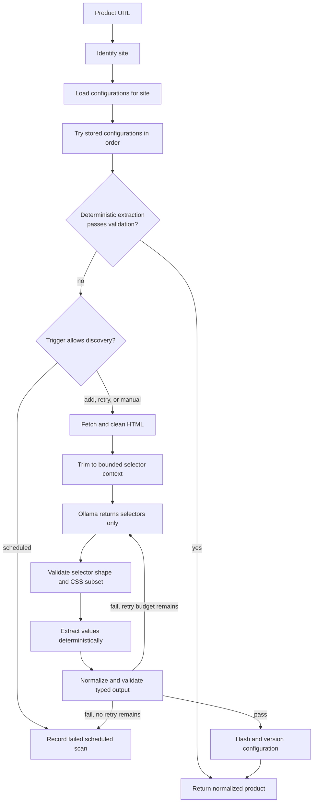
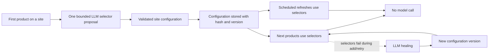
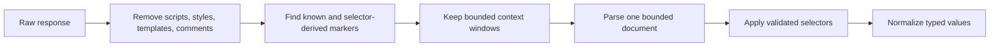
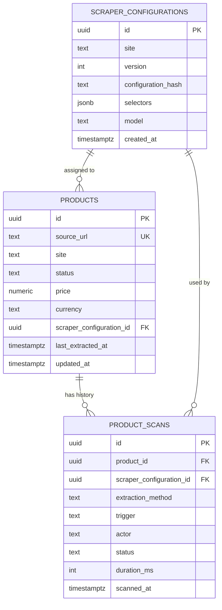
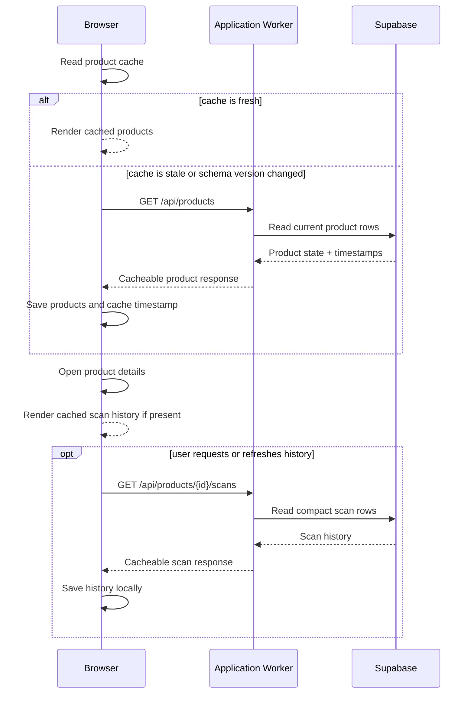
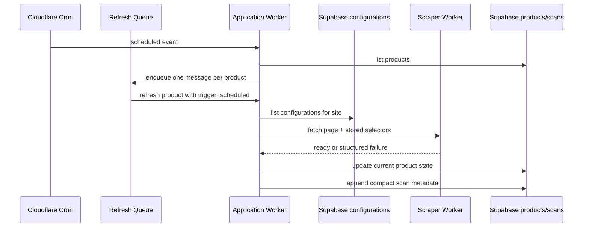

# Mantis

Mantis keeps track of product links with a small selector-discovery step and a deterministic extraction engine. The language model is used to find the right selectors when a website is new or when a stored configuration no longer works. Once a configuration is known, product refreshes use those selectors without calling the model again.

The system gets cheaper and more predictable as it learns each website. The model only suggests where each value is. The code fetches the page, checks the result, cleans it up, saves it, and records what happened.

## Architecture


```mermaid
flowchart LR
    UI[React product UI]
    APP[Mantis application Worker]
    SCRAPER[Scraper Worker<br/>Python + bounded DOM parser]
    DB[(Supabase<br/>products, configurations, scans)]
    LLM[Ollama Cloud<br/>selector discovery only]
    PAGE[Product page HTML]
    CRON[Cloudflare Cron<br/>current preview: every 30 minutes]
    QUEUE[Cloudflare Queue<br/>serialized refresh messages]

    UI -->|add, retry, view| APP
    APP -->|read/write product state| DB
    APP -->|stored selectors| SCRAPER
    SCRAPER -->|fetch| PAGE
    SCRAPER -->|new site or add/retry healing| LLM
    LLM -->|selector proposal| SCRAPER
    CRON --> QUEUE
    QUEUE -->|scheduled extraction| APP
    APP -->|scan metadata| DB
```

There are two Worker services:

- The application Worker serves the UI, product APIs, scheduled refreshes, queue processing, configuration lookup, and database writes.
- The scraper Worker fetches product pages and returns checked product data. It can use supplied selectors or discover selectors through Ollama Cloud.

The deployed path uses a small Python HTML parser in the scraper Worker. The local Python engine uses BeautifulSoup and follows the same selector, cleaning, and artifact steps for repeatable experiments.

## How extraction works

The model is not the scraper. It is only used to find selectors, and it receives a limited amount of cleaned page HTML.


```mermaid
flowchart TD
    START[Product URL] --> SITE[Identify site]
    SITE --> CONFIGS[Load configurations for site]
    CONFIGS --> TRY[Try stored configurations in order]
    TRY --> VALID{Deterministic extraction<br/>passes validation?}
    VALID -->|yes| READY[Return normalized product]
    VALID -->|no| PATH{Trigger allows discovery?}
    PATH -->|scheduled| FAILED[Record failed scheduled scan]
    PATH -->|add, retry, or manual| HTML[Fetch and clean HTML]
    HTML --> CONTEXT[Trim to bounded selector context]
    CONTEXT --> MODEL[Ollama returns selectors only]
    MODEL --> SELECTOR_VALIDATION[Validate selector shape and CSS subset]
    SELECTOR_VALIDATION --> EXTRACT[Extract values deterministically]
    EXTRACT --> OUTPUT_VALIDATION[Normalize and validate typed output]
    OUTPUT_VALIDATION -->|pass| SAVE_CONFIG[Hash and version configuration]
    SAVE_CONFIG --> READY
    OUTPUT_VALIDATION -->|fail, retry budget remains| MODEL
    OUTPUT_VALIDATION -->|fail, no retry remains| FAILED
```

For a new website, the first successful add normally takes the discovery path. The model receives a limited, cleaned view of the page and returns selectors for:

- product title;
- current price;
- product identifier such as an ASIN when present; and
- seller when present.

It does not return the product values themselves. It only tells us where to find them. After the selectors are accepted, the same deterministic code reads the values from the page and produces the final result.

For a later product on the same site, the application tries the stored site configurations first. If one works, there is no model call and no new configuration. If a configuration fails while adding, retrying, or manually extracting a product, the model can use the failure details to propose a replacement. Scheduled refreshes stay deterministic-only so background scans do not create unexpected model usage or cost.

## Why repeated use gets cheaper


```mermaid
graph LR
    A[First product on a site] --> B[One bounded LLM selector proposal]
    B --> C[Validated site configuration]
    C --> D[Configuration stored with hash and version]
    D --> E[Next products use selectors]
    D --> F[Scheduled refreshes use selectors]
    E --> G[No model call]
    F --> G
    E -. selectors fail during add/retry .-> H[LLM healing]
    H --> I[New configuration version]
    I --> E
```

The model is mainly used when the system first learns a website. After that, each refresh is just a page fetch, a limited parse, selector matching, cleanup, and a checked database write. Configuration hashes also stop the same selector set from being stored repeatedly.

## Validation and normalization

The data is checked at several points so a successful HTTP response is not mistaken for a valid extraction.

### Selector validation

The selector rules accept only the expected fields and reject malformed proposals. Each selector is checked for:

- a non-empty, bounded CSS expression;
- supported tags, IDs, classes, attributes, and simple selector paths;
- no comma selector groups or selectors that are too complex;
- valid text versus attribute operation; and
- a required attribute name when the operation is `attribute`.

Required fields are title and price. ASIN and seller are optional because a page may not expose them.

### Extracted value validation

The deterministic result is cleaned and checked before it reaches the UI or database:

- titles have whitespace collapsed and page-specific noise removed;
- prices become numeric values rather than formatted strings;
- currency is resolved from an explicit symbol/code or a supported site domain;
- mixed or conflicting currencies are rejected;
- thousands and decimal separators are interpreted before conversion;
- negative prices and ambiguous multiple amounts are rejected;
- identifiers are normalized to uppercase and invalid identifiers are discarded; and
- seller names are whitespace-normalized.

The application Worker checks the final response with Zod. The local Python engine uses Pydantic models, and the scraper Worker applies the same checks directly because it runs in Cloudflare's Python Worker runtime.

The database checks the data again with rules for product status, non-negative prices, three-letter currency codes, configuration versions, selector JSON, and links between products, configurations, and scans.

## CPU and HTML efficiency

Cloudflare puts a limit on how much work a Worker can do, so the scraper avoids repeatedly walking a full product document.


```mermaid
flowchart LR
    RAW[Raw response] --> CLEAN[Remove scripts, styles, templates, comments]
    CLEAN --> MARKERS[Find known and selector-derived markers]
    MARKERS --> WINDOW[Keep bounded context windows]
    WINDOW --> PARSE[Parse one bounded document]
    PARSE --> MATCH[Apply validated selectors]
    MATCH --> NORMALIZE[Normalize typed values]
```

The deployed scraper:

1. fetches the page once;
2. removes large non-content blocks such as scripts, styles, SVG, canvas, iframes, and comments;
3. derives context markers from the stored selectors and known product markers;
4. trims the evaluation document to a maximum of 120,000 characters around those markers;
5. parses the bounded document once;
6. limits selector complexity to a small supported CSS subset; and
7. extracts and normalizes values without another model call.

The model also receives only the cleaned context instead of the complete response. This means less prompt data, less memory use, less DOM work, and less unrelated page content influencing selector discovery.

The queue also keeps scheduled work controlled: the current preview uses one-message batches, one concurrent consumer, and a short delay between products. A slow page therefore affects one refresh at a time instead of causing a large burst of work.

## Persistence model


```mermaid
erDiagram
    SCRAPER_CONFIGURATIONS ||--o{ PRODUCTS : "assigned to"
    PRODUCTS ||--o{ PRODUCT_SCANS : "has history"
    SCRAPER_CONFIGURATIONS ||--o{ PRODUCT_SCANS : "used by"

    SCRAPER_CONFIGURATIONS {
        uuid id PK
        text site
        int version
        text configuration_hash
        jsonb selectors
        text model
        timestamptz created_at
    }

    PRODUCTS {
        uuid id PK
        text source_url UK
        text site
        text status
        numeric price
        text currency
        uuid scraper_configuration_id FK
        timestamptz last_extracted_at
        timestamptz updated_at
    }

    PRODUCT_SCANS {
        uuid id PK
        uuid product_id FK
        uuid scraper_configuration_id FK
        text extraction_method
        text trigger
        text actor
        text status
        int duration_ms
        timestamptz scanned_at
    }
```

### Products

The `products` table stores what we currently know about each product and what the user sees. A successful extraction updates the title, numeric price, currency, identifier, seller, the scraper configuration used, and `last_extracted_at`.

When a refresh is queued or fails, the write changes the status, error, and `updated_at` but does not replace the title or price. Supabase's merge-upsert keeps the last known product values available while showing that the latest attempt failed.

### Scraper configurations

Each configuration belongs to a website and stores selectors, model details, source, a canonical SHA-256 hash, and a version. Products point to the configuration that produced their latest successful extraction. A changed selector set becomes a new version instead of silently replacing the previous one.

### Product scans

`product_scans` is a small history of each scan rather than a copy of the full page. Each row records the extraction method, trigger, actor, configuration, status, duration, cleaned values when successful, and the error when it fails. This shows how often the deterministic path or the model path was used without storing full HTML for every refresh.

## Caching and history UX


```mermaid
sequenceDiagram
    participant Browser
    participant App as Application Worker
    participant DB as Supabase

    Browser->>Browser: Read product cache
    alt cache is fresh
        Browser-->>Browser: Render cached products
    else cache is stale or schema version changed
        Browser->>App: GET /api/products
        App->>DB: Read current product rows
        DB-->>App: Product state + timestamps
        App-->>Browser: Cacheable product response
        Browser->>Browser: Save products and cache timestamp
    end

    Browser->>Browser: Open product details
    Browser-->>Browser: Render cached scan history if present
    opt user requests or refreshes history
        Browser->>App: GET /api/products/{id}/scans
        App->>DB: Read compact scan rows
        DB-->>App: Scan history
        App-->>Browser: Cacheable scan response
        Browser->>Browser: Save history locally
    end
```

The product list is cached in the browser for 30 minutes and also cached by the Worker for 30 minutes, while allowing an older response to be used briefly during an update. A small cache-version marker forces one re-sync when the product response shape changes.

We only load scan history when someone opens a product and asks for it. If history has already been loaded, the detail page renders it from browser storage; the button remains available to fetch the current history again. This keeps the normal product list light while preserving the full extraction sequence when it is useful.

The product card shows the last successful extraction time and, for failed products, the latest failed attempt. The detail page shows both timestamps and can display the individual scan sequence, including the method, configuration, actor, trigger, duration, and error.

## Scheduled refreshes

The application Worker owns the scheduled trigger. The current preview configuration is:

```text
*/30 * * * *
```

At each trigger, the Worker reads the product list and sends refresh messages to the queue. Each message runs with the `scheduled` trigger, which uses stored deterministic configurations only. A successful scan updates the product and appends a ready scan row. A failed scan appends a failed scan row and leaves the previous extracted values intact.


```mermaid
sequenceDiagram
    participant Cron as Cloudflare Cron
    participant Queue as Refresh Queue
    participant App as Application Worker
    participant Config as Supabase configurations
    participant Scraper as Scraper Worker
    participant DB as Supabase products/scans

    Cron->>App: scheduled event
    App->>DB: list products
    App->>Queue: enqueue one message per product
    Queue->>App: refresh product with trigger=scheduled
    App->>Config: list configurations for site
    App->>Scraper: fetch page + stored selectors
    Scraper-->>App: ready or structured failure
    App->>DB: update current product state
    App->>DB: append compact scan metadata
```

Keeping interactive discovery separate from scheduled deterministic refreshes keeps background work limited and makes model usage visible in scan history and Worker logs.

## Local development

### TypeScript application

```powershell
npm install
npm run check
npm run dev
```

For a local Worker preview:

```powershell
npm run build
npx wrangler dev
```

The application health endpoint is `/api/health`.

### Python selector-discovery engine

Python is pinned to 3.11 and dependencies are managed with UV.

```powershell
uv sync
uv run pytest
```

Set `OLLAMA_API_KEY` in `.env`. Optional settings are `OLLAMA_MODEL`, `OLLAMA_BASE_URL`, and `OLLAMA_STRUCTURED_METHOD`.

List available Ollama models:

```powershell
uv run python -m mantis_scraper models
```

Run discovery and deterministic extraction for one page:

```powershell
uv run python -m mantis_scraper discover --url "https://example.com/product"
```

Each local run is written under `data/runs/` and includes:

- `page.html`: fetched source HTML;
- `page.json`: fetch metadata and final URL;
- `model-input.html`: bounded HTML sent to the model;
- `selector-config.json`: selector-only configuration;
- `validation.json`: selector match counts;
- `extraction.json`: normalized product output; and
- `attempts.json` or `failure.json`: validation and retry evidence.

These local files are useful for reviewing extraction behavior. The deployed preview currently saves product, configuration, and scan details in Supabase; it does not yet write raw HTML to Cloudflare Artifact or R2 storage.

## Deployment

The application Worker is deployed from the repository root:

```powershell
npm run deploy:dry-run
npm run deploy
```

The scraper Worker is configured separately under `scraper-worker/` and is published as `mantis-scraper-preview`. Its Ollama secret is configured in Cloudflare rather than committed to the repository.

Current preview endpoints:

- Application: <https://mantis-preview.prateekdwivedi30.workers.dev>
- Application health: <https://mantis-preview.prateekdwivedi30.workers.dev/api/health>
- Scraper health: <https://mantis-scraper-preview.prateekdwivedi30.workers.dev/api/health>

## How to inspect what happened

The system exposes evidence at three levels:

1. The UI shows current product values, status, last extraction timing, and gated refresh history.
2. Supabase stores the current product row, the assigned configuration, and compact scan records.
3. Worker logs include the site, URL, trigger, actor, method, configuration ID/version, model, status, duration, and error when present.

This makes it possible to answer whether a product used a stored deterministic configuration or LLM discovery, whether the same configuration was reused across products, and whether a failed refresh later recovered.

## Tests

The normal verification command runs TypeScript type checking, Vitest, and the Vite production build. The Python test suite can be run separately:

```powershell
npm run check
uv run pytest
```
